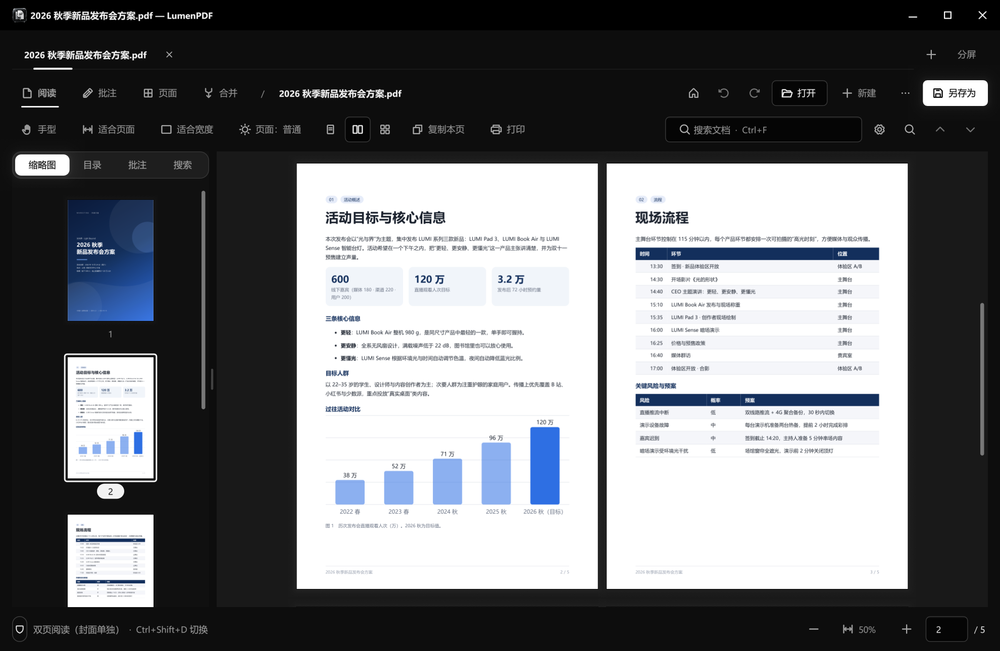
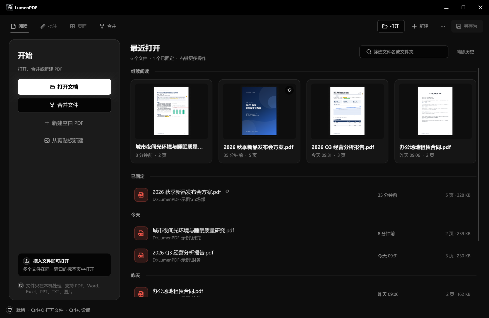
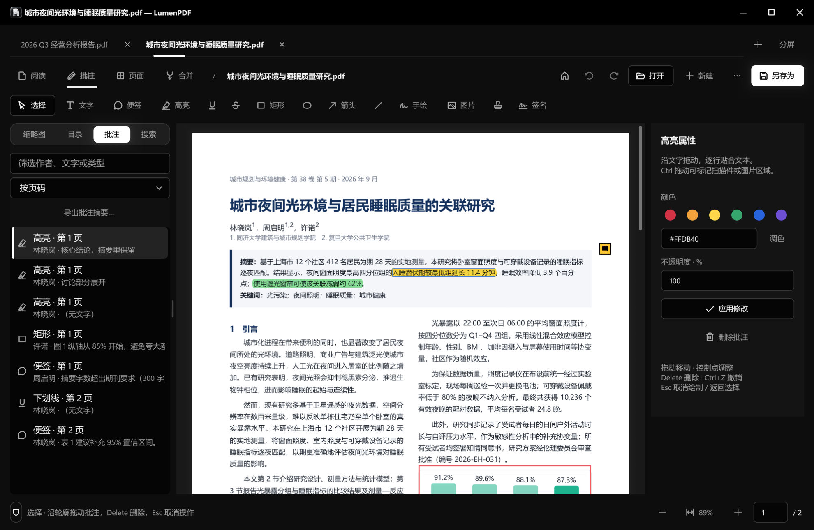
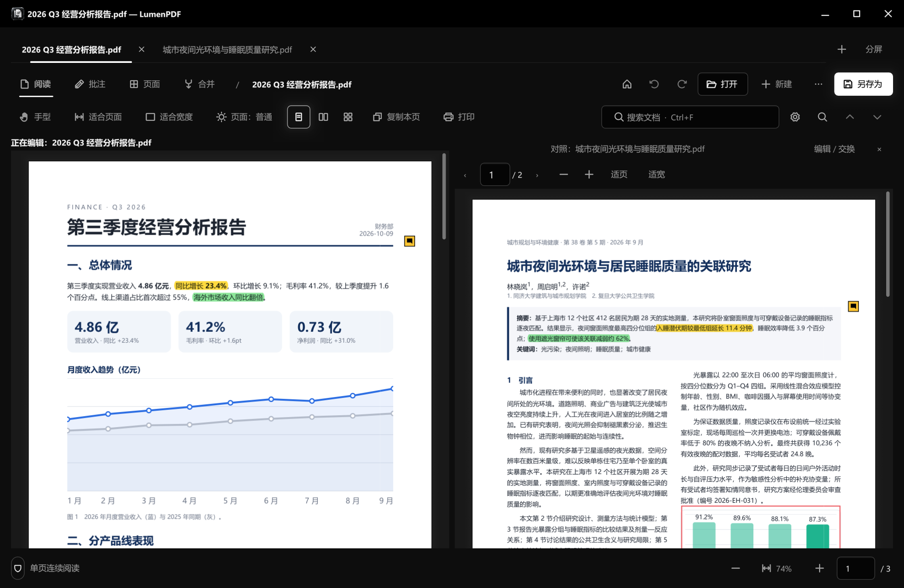
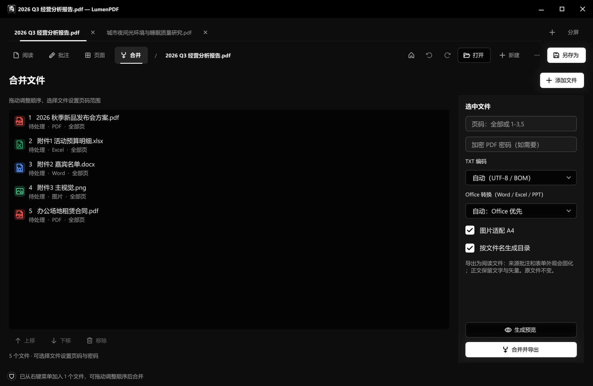
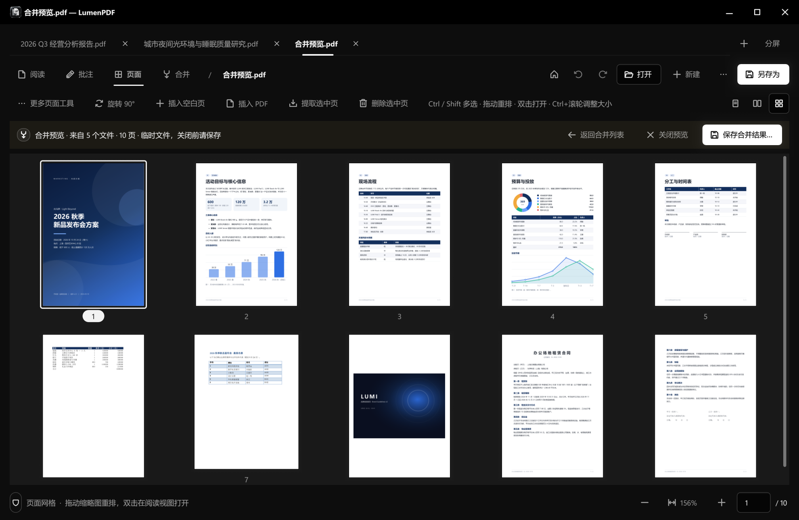

# LumenPDF

**轻量、本地、开源的 Windows PDF 阅读与整理工具。** 安装包约 22 MB，打开快、占用小；阅读、批注、填表签名、涂黑、合并拆分、压缩、Office 转 PDF 都在本机完成，文档不上传。

C++20 · [MuPDF 1.28.4](https://mupdf.com) · [LUMEN](https://github.com/jimmgreen/LUMENUI) 界面库 · Windows 10 1809+ / 11 x64 · AGPL-3.0

<p align="center">
  <a href="https://github.com/jimmgreen/LumenPDF/releases/latest"></a>
  
  
</p>

<p align="center"></p>

## 界面一览

<table>
  <tr>
    <td width="50%" valign="top"><br><b>主页</b> · 最近打开的文件带页面缩略图，按今天 / 昨天 / 更早分组，可固定常用文件</td>
    <td width="50%" valign="top"><br><b>批注</b> · 高亮、下划线、便签、形状、手绘、签名；侧栏按页列出全部批注，选中即可改颜色与透明度</td>
  </tr>
  <tr>
    <td width="50%" valign="top"><br><b>多标签 + 分屏对照</b> · 多个文档在同一窗口的标签页中打开，左右或上下分屏对照阅读，一键交换编辑侧</td>
    <td width="50%" valign="top"><br><b>混合格式合并</b> · PDF、Word、Excel、PPT、TXT、图片一起合并，可设页码范围、按文件名生成目录</td>
  </tr>
</table>

<sub>截图中的文档均为演示用的虚构内容。</sub>

## 下载

从 [GitHub Releases](https://github.com/jimmgreen/LumenPDF/releases/latest) 下载最新版本：

| 文件 | 说明 |
| --- | --- |
| `LumenPDF-<版本>-setup.exe` | 安装版：按当前用户安装，无需管理员权限；可登记为 PDF 打开程序、添加右键“使用 LumenPDF 合并” |
| `LumenPDF-<版本>-portable-x64.zip` | 便携版：解压即用，整个文件夹可随意移动 |
| `SHA256SUMS` | 安装包的 SHA-256 校验值 |

**国内下载慢？** 在 GitHub 下载地址前加上加速镜像前缀即可，例如 v0.4.0 安装版：

```
https://gh-proxy.com/https://github.com/jimmgreen/LumenPDF/releases/download/v0.4.0/LumenPDF-0.4.0-setup.exe
https://ghfast.top/https://github.com/jimmgreen/LumenPDF/releases/download/v0.4.0/LumenPDF-0.4.0-setup.exe
```

这些镜像是第三方公益服务，可用性随时可能变化；下载后可用 `SHA256SUMS` 核对（PowerShell：`Get-FileHash <文件>`）。
安装后程序会自动通过可用的线路升级，无需再手动找镜像。

## 功能

- **阅读**：连续 / 翻页 / 单双页 / 页面网格；缩略图、目录、批注列表、全文搜索；多文档标签与同窗分屏；护眼与夜间配色；框选放大与放大镜；全屏演示；临时旋转视图；记住每个文件的阅读位置。
- **批注**：文字框（本机字体、粗斜体、下划线、对齐）、便签、高亮、下划线、删除线、矩形、椭圆、直线、箭头、手绘、印章、图片；保存后仍是标准 PDF 批注，可在其它阅读器中编辑。
- **填写与签名**：AcroForm 表单填写；手写 / 图片签名、日期、✓ ✗ 快速放置。
- **涂黑**：真正删除选中区域下的文字、图片和矢量内容，并另存副本（不是盖一个黑框）。
- **页面整理**：拖动重排、旋转、删除、插入空白页或其它 PDF、提取、裁剪；撤销 / 重做。
- **合并**：PDF、Word、Excel、PowerPoint、TXT、图片混合合并，可选页码范围，按文件名生成目录；资源管理器右键多选文件直接合并。
- **文档工具**：压缩、拆分、页眉页脚 / 页码 / 水印、书签编辑、加密与去除密码（AES-256）、导出 PNG / TXT、剪贴板截图直接生成 PDF。
- **打印**：打印预览、多页合一、小册子、页面范围与缩放。
- **朗读**：用 Windows 自带语音朗读选中文字、本页或到文末。
- **安全保存**：先写临时文件并验证能重新打开，再替换原文件；编辑中每 60 秒自动备份，异常退出后可恢复。

Word / Excel / PowerPoint 转换使用本机已安装的 Microsoft Office（或 LibreOffice）；没有安装时其它功能不受影响。

<p align="center"><br><sub>合并预览在页面网格中打开：发布会方案、Excel 预算表、Word 名单、图片与合同合成 10 页，可继续拖动重排、旋转或删除后保存。</sub></p>

## 在线升级与隐私

LumenPDF 处理文档时**完全不联网**。唯一的网络访问是“检查更新”：

- **自动检查**：启动约 10 秒后在后台进行，每天最多一次；可在“设置”中关闭。“更多 → 检查更新”可随时手动检查。
- **只下载、不上传**：只请求版本信息（`latest.json`）和安装包，不发送任何文档、设备标识或使用数据；自动遵循系统代理设置。
- **国内可用**：版本信息同时从 GitHub、jsDelivr CDN 和 GitHub 加速镜像获取；下载安装包前先对各线路测速，自动选择最快的一条，断线后换线路续传。
- **防篡改**：版本信息带 ECDSA P-256 签名，程序内置公钥验证，签名不符即拒绝；安装包下载后校验 SHA-256（值来自已签名的版本信息），第三方镜像无法替换安装包。
- **用户确认**：发现新版本时显示更新说明，可选“下载并安装 / 跳过此版本 / 以后再说”；下载完成后再确认一次才安装。安装前会逐份询问未保存的文档。
- **安装方式**：安装版静默运行新安装程序（保留原安装位置和选项）后自动重新打开；便携版在程序退出后替换文件，任何文件替换失败都会自动回滚到原版本。

升级签名公钥指纹：`243f5b8575acdd94`（`app/update_public_key.h`）。

## 从源码构建

需要：Visual Studio 2022（“使用 C++ 的桌面开发”，含 Windows SDK）、CMake 3.25+、Ninja、Git、PowerShell。

```bat
git clone --recursive https://github.com/jimmgreen/LumenPDF.git
cd LumenPDF
build.bat
```

- `build.bat` 首次运行时下载并编译固定版本的 MuPDF 1.28.4（校验 SHA-256 `2D97E043A616F96B148657C9C3D81AD71C4BD2052C59A2A3315AD842599340F9`），然后编译并运行全部测试（`ctest`）。
- LUMEN 界面库以 git submodule 形式位于 `third_party/LUMENUI`；若不存在，则回退到并列目录 `../LUMENUI`，也可用 CMake 变量 `LUMEN_SOURCE_DIR` 指定。
- 产物：`build/app/LumenPDF.exe`（同目录的 `lumatext.dll` 为文字渲染依赖）。
- `scripts/package.ps1` 生成便携目录、便携 zip，找到 Inno Setup 6 时同时生成安装程序。

目录结构：`core/` PDF 文档逻辑（MuPDF）；`app/` 界面与交互；`tests/` 回归测试与样本；`installer/` Inno Setup 脚本；`scripts/` 构建、打包与发布工具；`docs/` 设计说明与[开发记录](docs/开发记录.md)。

### 发布新版本（维护者）

1. 修改 `CMakeLists.txt`、`app/app.rc`、`installer/LumenPDF.iss` 中的版本号，运行 `build.bat` 与 `scripts/package.ps1`。
2. 生成并签名升级清单（私钥在仓库之外，默认 `%USERPROFILE%\.lumenpdf\update-signing-key.pem`）：
   ```bat
   python scripts\update_signing.py manifest --version x.y.z --notes-file notes.md ^
       --setup dist\LumenPDF-x.y.z-setup.exe --portable dist\LumenPDF-x.y.z-portable-x64.zip ^
       --out update\latest.json --sums dist\SHA256SUMS
   ```
3. 创建 GitHub Release（标签 `vx.y.z`），上传安装版、便携版、`latest.json`、`latest.json.sig`、`SHA256SUMS`；把 `update/latest.json(.sig)` 提交到 `main`（供 jsDelivr 分发）。

## 许可

LumenPDF 按 [GNU Affero 通用公共许可证 v3](LICENSE)（或更新版本）发布。

- MuPDF：Artifex Software，AGPL-3.0 / 商业双许可，本项目使用其 AGPL 许可；其随附依赖的声明在发行包 `notices/MuPDF/`。
- LUMEN 界面库：MIT，声明在发行包 `notices/LUMEN-MIT.txt`。
- LumaText 文字排版：MIT，以预编译库形式随 LUMEN 提供，许可在发行包 `licenses/`。
- LUMEN 内含移植自 [Paper Shaders](https://shaders.paper.design) 的着色器代码：Apache-2.0，声明在发行包 `notices/PaperShaders/`。
- Microsoft C++ 运行库按其运行库许可随附，不属于本项目的 AGPL 授权范围。
